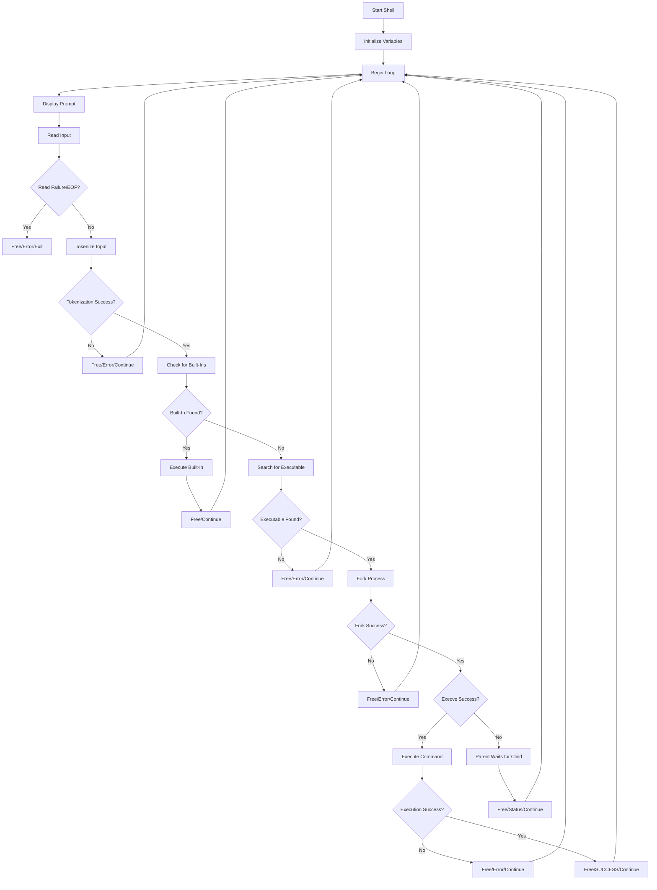

# Simple Shell Project

## Contents

[Synopsis](#synopsis)<br>
[Description](#description)<br>
[Authors](#authors)<br>
[Use Instructions](#use-instructions)<br>
[Flowchart](#flowchart)<br>

## Synopsis

This project creates a simple Unix-like shell program, codenamed T.S. SHELLiot (Thames-Sexton Shell), taking in user input and executing the given commands.

## Description

T.S. SHELLiot implements a simple command-line shell that mimics basic Unix shell functionality. It continuously displays a prompt ($) and allows users to execute commands by typing them into the terminal. The shell can handle interactive and non-interactive modes, parsing user input and executing commands using execve. It also gracefully handles end-of-file (EOF) signals and displays appropriate error messages for invalid commands.

## Use Instructions

**Clone into T.S. SHELLiot's Repository:**
```
git clone https://github.com/seer9/atlas-simple_shell.git
```

**Open the Shell Directory:**
```
cd atlas-simple_shell
```

**Run Shell Program:**
```
./hsh
```

**Enter Commands:**
```
What we call the beginning is often the end
TS SHELLIOT $
```

## Flowchart



## Authors

[@internashionalist](https://github.com/internashionalist/internashionalist/blob/main/README.md)

[@seer9]()
